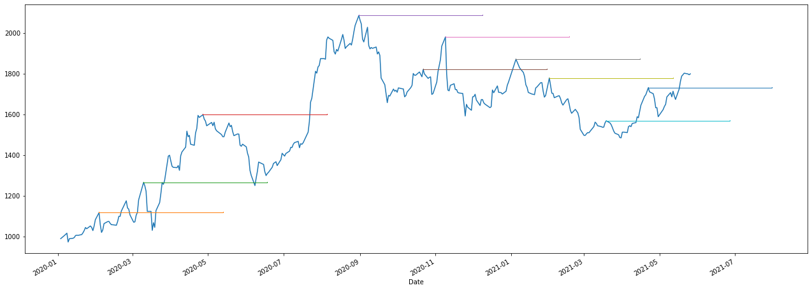

 2 ноутбука с разметками уровней поддержки и сопротивления..
 

*[trendln](https://github.com/GregoryMorse/trendln)*

*[Calculating Resistance and Pivot points with Python](https://medium.com/code-for-cause/calculating-resistance-and-pivot-points-with-python-caffbad46715)*

## Задача:
1) Разметить график: 
      обозначить точки локальных максимумов
      обозначить точки локальных минимумов
      исключить лишние ( с помощью ATR)
2) Обучить нейросеть находить эти точки самостоятельно ( таймфрейм 1 час и 5 мин)
3) Разрешить совершить сделку на 5 минутах если появился сигнал на 1 часе
4) Провести backtest и по результатам задать параметры риск менеджера ( принудительное закрытие сделки, запрет сделки)
5) Запустить работу в автоматическом режиме ( связь с торговым терминалом)

## Программа должна позволять и выполнять:
1) Взаимодействовать с торговым терминалом
2) Выбор инструмента
3) Выбор объема позиции
4) тображать графики свечей
5) Показывать на графиках точки совершения сделок
6) Выдавать отчёт о торговле ( день, неделя, месяц, год)

## Общая задача:
Сделать торговлю максимально прибыльной и автоматизированной
