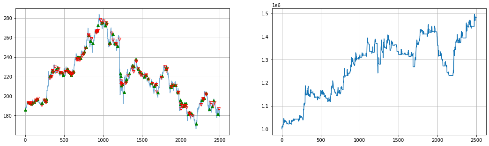
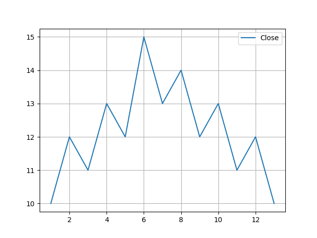
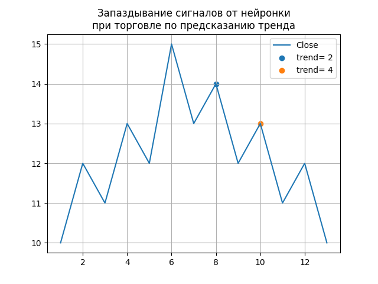

## Методическое пособие к открытому уроку по применению Нейронных сетей в трейдинге

*"Уолл-Стритт никогда не меняется, меняются деньги, меняются участники, меняются акции, но Уолл-стритт никогда не меняется, потому что не меняется природа человека".
Джесси Ливермор*

# Цели и задачи урока:
У Вас появится понимание об основных направлениях использования нейронных сетей в алгоритмическом трейдинге.
А также изучите код стратегии торговли "По предсказанию тренда" и сможете самостоятельно существенно улучшить эту стратегию в ходе выполнения Домашних заданий.

Итак, как же заработать от 40% в год?

# Базовые понятия:
1.  Свеча
2.  Паттерн
3.  Технический индикатор
4.  Стакан
5.  Лонг
6.  Шорт
7.  Журнал Торговли

## Направления использования НС в трейдинге:
1.  Торговля на основе семантического анализа
2.  Высокочастотная торговля по стакану
3.  Предсказание тренда
4.  Торговля по техническим индикаторам
5.  Выявление паттернов
6.  Попытки применения обучения с подкреплением, GANов, AE для выявления аномалий..
7.  Предсказание цены. Из более чем 500 статей по применению нейронных сетей в алгоримическом трейдинге, я не видел ни одной, в которой был бы опубликован журнал торговли.
Из чего делаю вывод, что предсказание цены - это своеобразный код проверки свой-чужой.

    
### Что такое тренд и как обьяснить это компьютеру?
**Определение:** 

Рост = 1, Плато = 0, Падение = -1

Тренд по разностям (Close[i] - Close[i-1]):  [0, 1, -1, 1, -1, 1, -1, 1, -1, 1, -1, 1, -1] - хаос: тренда нет

Тренд по разностям (Close[i] - Close[i-2]):  [0, 0, 1, 1, 1, 1, 1, -1, -1, -1, -1, -1, -1] - тренд очевиден

Тренд по разностям (Close[i] - Close[i-3]):  [0, 0, 0, 1, 0, 1, 0, 1, -1, 0, -1, 0, -1] - почти хаос ;(

Тренд по разностям (Close[i] - Close[i-4]):  [0, 0, 0, 0, 1, 1, 1, 1, 0, -1, -1, -1, -1] - тренд появился, но видно запаздывание

**Вывод:** Не каждый тренд подходит конкретному временному ряду!

## Торговля по тренду
**Сильные стороны Стратегии:** позволяет поймать глобальные тренды и избежать мелких частых сделок

**Слабые стороны Стратегии:** запаздывание, равное числу баров, по которым строится тренд

## Тестирование модели

* определение "полей доходности" при подборе тренда и ансамбей данных
* определение оптимальной частоты для переобучения

## Рекомендуемая литература:
1.  Б. Грэм - Разумный инвестор - 2014
2.  Л. Борселино - Дэйтрейдер-кровь, пот и слезы успеха - 2001
3.  Лефевр Э. - Воспоминания биржевого спекулянта (Люди и деньги) - 2004
4.  Джон Богл - Руководство разумного инвестора - 2013
5.  Найман - Малая энциклопедия трейдера
6.  Ричард Смиттен - Жизнь и смерть величайшего биржевого спекулянта.