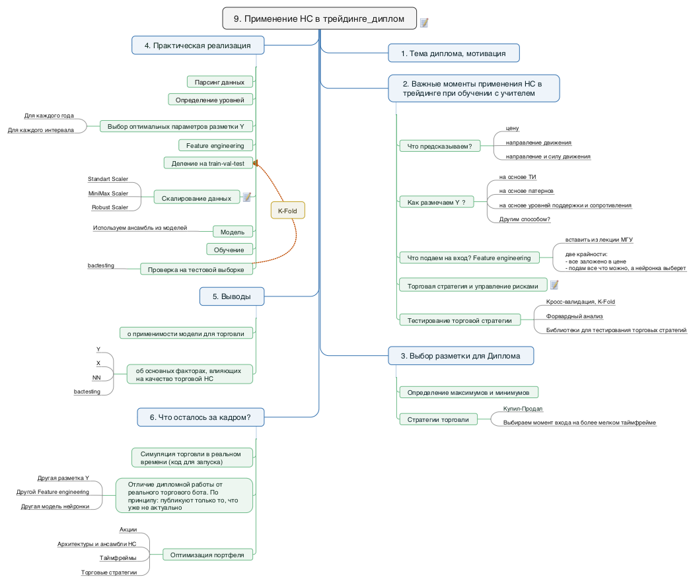

Есть несколько способов применение нейронных сетей (НС) в трейдинге.

Самые простые (но это не значит, что не эффективные):
- предсказание цены акции (задача регрессии)
- предсказание направления движения цены (задача классификации)

В этом разделе я рассмотрю простой пример написание НС для торговли с помощью предсказания направления ее движения

План работы: 

