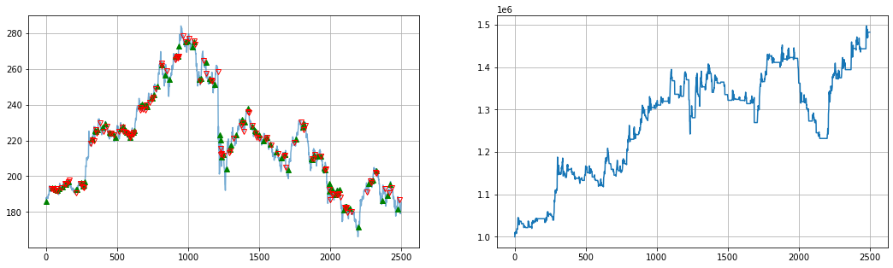
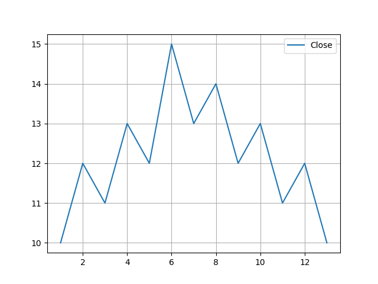
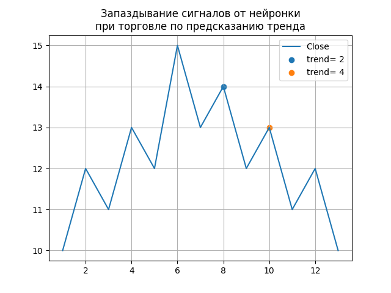
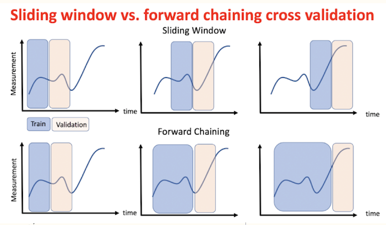
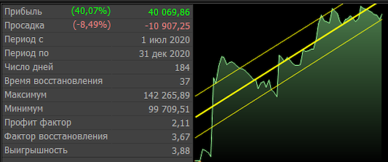
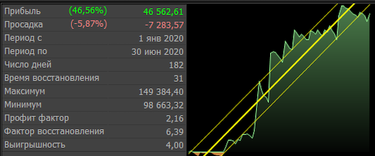

## Методическое пособие к открытому уроку по применению Нейронных сетей в трейдинге

*"Уолл-Стритт никогда не меняется, меняются деньги, меняются участники, меняются акции, но Уолл-стритт никогда не меняется, потому что не меняется природа человека".
Джесси Ливермор*

# Цели и задачи урока:
У Вас появится понимание об основных направлениях использования нейронных сетей в алгоритмическом трейдинге.
А также изучите код стратегии торговли "По предсказанию тренда" и сможете самостоятельно существенно улучшить эту стратегию в ходе выполнения Домашних заданий.

Итак, как же заработать от 40% в год?

# Базовые понятия
1.  [Свеча](https://ru.wikipedia.org/wiki/%D0%AF%D0%BF%D0%BE%D0%BD%D1%81%D0%BA%D0%B8%D0%B5_%D1%81%D0%B2%D0%B5%D1%87%D0%B8)
2.  [Паттерн](https://ru.wikipedia.org/wiki/%D0%9F%D0%B0%D1%82%D1%82%D0%B5%D1%80%D0%BD_(%D1%82%D0%B5%D1%85%D0%BD%D0%B8%D1%87%D0%B5%D1%81%D0%BA%D0%B8%D0%B9_%D0%B0%D0%BD%D0%B0%D0%BB%D0%B8%D0%B7))
3.  [Технический индикатор](https://ru.wikipedia.org/wiki/%D0%A2%D0%B5%D1%85%D0%BD%D0%B8%D1%87%D0%B5%D1%81%D0%BA%D0%B8%D0%B9_%D0%B8%D0%BD%D0%B4%D0%B8%D0%BA%D0%B0%D1%82%D0%BE%D1%80)
4.  [Стакан](https://bcs-express.ru/novosti-i-analitika/o-chem-mogut-rasskazat-birzhevoi-stakan-i-lenta-sdelok)
5.  [Лонг](https://help.tinkoff.ru/margin-trade/long/what-is/)
6.  [Шорт](https://help.tinkoff.ru/margin-trade/short/what-is/)
7.  [Журнал Торговли](https://github.com/ikonushok/AI-Traiding/blob/main/Open%20Lesson%20AI_Trading/data/Val_153547_t14_e30_SBER_Conv_1h_Up_v1.txt)
    и [для чего он нужен](https://traderblog.net/torgovyj-zhurnal-trejdera/)
8.  [Управление рисками](https://equity.today/risk-menedzhment-v-trejdinge.html)

## Направления использования НС в трейдинге
1.  Торговля на основе семантического анализа
2.  Высокочастотная торговля по стакану
3.  [Предсказание тренда](https://github.com/ikonushok/AI-Traiding/tree/main/Trend%20Prediction)
4.  Торговля по техническим индикаторам
5.  Выявление паттернов
6.  Попытки применения обучения с подкреплением, GANов, AE для выявления аномалий..
7.  Предсказание цены.
    
## Торговля по тренду
### Что такое тренд и как обьяснить это компьютеру?
**[Определение](https://ru.fxssi.com/kak-opredelit-trend-na-rynke):** Тренд – это направленное движение цены.
Умение правильно определять тренд может значительно повысить результативность сделок.

Различают три вида трендов:
* Восходящий (бычий) тренд.
* Нисходящий (медвежий) тренд.
* Горизонтальный тренд (флэт).

**Восходящий тренд** – это последовательность растущих максимумов и минимумов, причем каждый последующий максимум и минимум выше предыдущего.

Рост = 1, Плато = 0, Падение = -1

Тренд по разностям (Close[i] - Close[i-1]):  [0, 1, -1, 1, -1, 1, -1, 1, -1, 1, -1, 1, -1] - хаос: тренда нет

Тренд по разностям (Close[i] - Close[i-2]):  [0, 0, 1, 1, 1, 1, 1, -1, -1, -1, -1, -1, -1] - тренд очевиден

Тренд по разностям (Close[i] - Close[i-3]):  [0, 0, 0, 1, 0, 1, 0, 1, -1, 0, -1, 0, -1] - почти хаос ;(

Тренд по разностям (Close[i] - Close[i-4]):  [0, 0, 0, 0, 1, 1, 1, 1, 0, -1, -1, -1, -1] - тренд появился, но видно запаздывание

**Вывод:** Не каждый тренд подходит конкретному временному ряду!

**Сильные стороны Стратегии:** позволяет поймать глобальные тренды и избежать мелких частых сделок

**Слабые стороны Стратегии:** запаздывание, равное числу баров, по которым строится тренд

Пример запаздывания:

## Схема программы

## Тестирование модели

* определение "полей доходности" при подборе тренда и ансамблей данных
* определение оптимальной частоты для переобучения

## Для чего нужно переобучать модель
Рынок не соверншенен. Трейдеры, занимающиеся алгоритмической торговлей, постоянно ищут эти несовершенства для получения прибыли.
Но! Рынок постоянно меняется под влиянием внешних факторов и того, что критическое число игроков находит "лазейку".. Соответственно, она перестает работать..
Приходится переобучать модель.

Вот простой пример на 2020 годе и часовиках акции POLY:
Определим в торговом терминале Alfa-Direct наилучшие параметры для простой стратегии на скользящих средних:

Если бы мы торговали весь 2020 на оптимальных параметрах:

    * быстрая = 3 бара
    * медленная = 20 баров

То заработали бы 40 тыс рублей:

  

Но!
Если бы мы первые пол года торговали на той же стратегии, но с другими настройками:

    * быстрая = 4 бара
    * медленная = 16 баров

а во втором полугодии поменяли бы настройки на:

    * быстрая = 2 бара
    * медленная = 29 баров 

То заработали бы 46 + 40 = 86 тыс рублей:

 и

Этим и хорошие нейронные сети - они самостоятельно подстраиваются под изменения, произошедшие на рынке.

Но для этого мы должны сами установить периодичность их переобучения.

# А теперь перейдем к коду
В ноутбуке реализована простая модель, торгующая только в лонг.

Нейронка выдаетвсего 2 сиглала (signals):

    * 1 - купить (когда прогнозируется растущий тренд))
    * 0 - выйти в кэш (когда прогнозируется нисходящийтренд)

Ситуации, когда цена не меняется игнорируются.

В соответствии с сигналами модели, трейдер занимает 2 позиции (statements):

    * 1 - лонг
    * 0 - кэш

Акции покупаются на весь имеющийся депозит.

Комиссия брокера = 0

Управление рисками отсутствует.

## Проверка модели
[Статья о скользящем контроле](http://www.machinelearning.ru/wiki/index.php?title=CV)

### Скользящий контроль в задачах прогнозирования
В задачах прогнозирования, динамического обучения, обучения с подкреплением
и активного обучения прецеденты изначально линейно упорядочены по времени их появления. 
В этом случае варианты скользящего контроля не так разнообразны.

### Применения скользящего контроля
На практике скользящий контроль применяется для оптимизации некоторых критически важных параметров,
как правило, определяющих структуру или сложность используемой модели алгоритма,
и имеющих относительно небольшое число возможных значений.

### Недостатки скользящего контроля
1.  Задачу обучения приходится решать N раз, что сопряжено со значительными вычислительными затратами.
2.  Оценка скользящего контроля предполагает, что алгоритм обучения \mu уже задан. 
    Она ничего не говорит о том, какими свойствами должны обладать «хорошие» алгоритмы обучения, 
    и как их строить. Такого рода подсказки дают, например, теоретические оценки обобщающей способности.
3.  Попытка использовать скользящий контроль для обучения, в роли оптимизируемого критерия, 
    приводит к тому, что он утрачивает свойство несмещённости, и снова возникает риск переобучения.
4.  Скользящий контроль дает несмещенную точечную, но не интервальную оценку риска. 
    В настоящее время не существует методов построения на основе скользящего контроля точных
    доверительных интервалов для риска, то есть математического ожидания потерь (в частности,
    вероятности ошибочной классификации).

# Рекомендуемая литература
1.  Б. Грэм - Разумный инвестор - 2014
2.  Л. Борселино - Дэйтрейдер-кровь, пот и слезы успеха - 2001
3.  Лефевр Э. - Воспоминания биржевого спекулянта (Люди и деньги) - 2004
4.  Джон Богл - Руководство разумного инвестора - 2013
5.  Найман - Малая энциклопедия трейдера
6.  Ричард Смиттен - Жизнь и смерть величайшего биржевого спекулянта.
